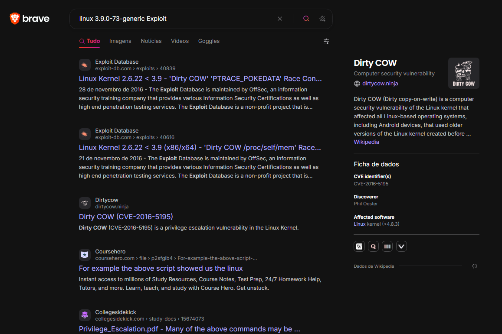

# Aula 9

## Escalada de privilégios

Normalmente, num primeiro contexto, vamos ter acesso primário como usuário de baixo nível, então não podemos interagir tanto com o sistema (a menos que todos os usuários tenham as mesmas permissões, o que é raro). Então, para conseguir mais acesso, precisamos escalar nossos privilégios.

Para isso, o primeiro passo é encontrar uma vulnerabilidade interna para ganhar acesso ao root no linux ou SYSTEM/NT AUTHORITY no Windows.

## PrivEsc Checklist
Já aprendemos que a enumeração é crucial no pentest, e a escalada de privilégios não é diferente. Antes de atacar precisamos reconhecer o terreno e saber onde estamos pisando. Para isso, podemos fazer tudo na mão (o que não é a ideia mais inteligente possível) ou usar ferramentas automatizada como o hacktricks, que tem um repertório alto  tanto sobre [linux](https://book.hacktricks.wiki/en/linux-hardening/linux-privilege-escalation-checklist.html) quanto sobre [windows](https://book.hacktricks.wiki/en/windows-hardening/checklist-windows-privilege-escalation.html). Outra opção é opayload all the things, que tem uma checklist para [linux](https://github.com/swisskyrepo/PayloadsAllTheThings/blob/master/Methodology%20and%20Resources/Linux%20-%20Privilege%20Escalation.md) e [windows](https://github.com/swisskyrepo/PayloadsAllTheThings/blob/master/Methodology%20and%20Resources/Windows%20-%20Privilege%20Escalation.md).

A maioria dos comandos pode ser executado automaticamente com scripts que vão procurar e reportar as vulnerabilidades encontradas. os principais comandos são [LinEnum](https://github.com/rebootuser/LinEnum) e [linuxPrivChecker](https://github.com/sleventyeleven/linuxprivchecker) para linux e [Seatbelt](https://github.com/GhostPack/Seatbelt) e [JAWS](https://github.com/411Hall/JAWS) para windows.

Outra ferramenta para enumeração de servidores é o [Privilege Escalation Awesome Scripts Suite](https://github.com/peass-ng/PEASS-ng) que tem scripts para linux e windows.

**OBSERVAÇÂO IMPORTANTE: Esses scripts fazem MUITO barulho, então é recomendado rodá-los em ambientes de teste ou em ambientes onde o barulho não seja um problema. Caso você não queira ser descoberto ao tentar invadir uma empresa, é recomendado que você faça a enumeração manual**

Exemplo de execução do LinPEAS:

```bash
[!bash!]$ ./linpeas.sh
...SNIP...

Linux Privesc Checklist: https://book.hacktricks.xyz/linux-unix/linux-privilege-escalation-checklist
 LEYEND:
  RED/YELLOW: 99% a PE vector
  RED: You must take a look at it
  LightCyan: Users with console
  Blue: Users without console & mounted devs
  Green: Common things (users, groups, SUID/SGID, mounts, .sh scripts, cronjobs)
  LightMangenta: Your username


====================================( Basic information )=====================================
OS: Linux version 3.9.0-73-generic
User & Groups: uid=33(www-data) gid=33(www-data) groups=33(www-data)
```

Um sistema operacional antigo e sem atualizações é um prato cheio para um atacante. Isso porque, com o tempo, vulnerabilidades são descobertas e corrigidas, então um sistema desatualizado é um sistema vulnerável. Caso a versão do alvo seja antiga, não esqueça de procurar por exploits de kernel. Vamos usar o código acima como exemplo.

A versão documentada é a 3.9.0-73-generic, então vamos procurar por exploits de kernel para essa versão. Para isso, podemos usar o [searchsploit](8_exploits.md) ou simplesmente pesquisar no google.
search exploit: 
```bash
[!bash!]$ searchsploit linux kernel 3.9.0
```
Google:


Ambos os casos vamos escontrar a mesma principal vulnerabilidade, Dirty Cow. Essa vulnerabilidade é um exploit de escalada de privilégios que permite que um usuário comum ganhe acesso ao root. O exploit é bem simples de usar, e pode ser encontrado no [github](https://github.com/dirtycow/dirtycow.github.io/wiki/PoCs). 

Obviamente isso também se aplica a outros sistemas. É bom lembrar que exploits de Kernel causam MUITA instabilidade no sistema, então toma cuidado.

### Vulnerabilidades de software

Outro ponto crucial são softwares instalados. com o comando `dpkg -l` no linux e abrindo o diretório `C:\"Program Files"` ou `wmic product get name` no windows, podemos ver todos os softwares instalados no sistema. Com isso, podemos procurar por exploits para esses softwares. Podemos procurar vulnerabilidades nesses softwares.

### Privilégios do usuário

Você não quer ficar 40 minutos explorando uma vulnerabilidade pra executar o bash como root e descobrir que você já podia fazer isso. Então, antes de tudo, verifique se você tem permissões de sudo. Isso pode ser feito com o comando `sudo -l` ou `suid` no linux e `whoami /priv` no windows.

O comando sudo -l vai mostrar quais comandos você pode executar como root. Se você tiver permissão para executar qualquer comando, você pode simplesmente executar `sudo su` e ganhar acesso ao root. Se você tiver permissão para executar um comando específico, você pode tentar explorar esse comando.

```bash
[!bash!]$ sudo -l

[sudo] password for user1:
...SNIP...

User user1 may run the following commands on ExampleServer:
    (ALL : ALL) ALL
```

No caso acima, o usuário user1 pode executar qualquer comando como root. Então, se você tiver a senha do usuário, você pode simplesmente executar `sudo su -` e ganhar acesso ao root.    

```
[!bash!]$ sudo su -

[sudo] password for user1:
whoami
root
```

Em alguns casos não precisamos fornecer a senha do usuário.

```bash
[!bash!]$ sudo -l

    (user : user) NOPASSWD: /bin/echo
```

```bash
[!bash!]$ sudo -u user /bin/echo Hello World!

    Hello World!
```

O comando acima vai executar o comando echo como o usuário user. Isso pode ser explorado para executar comandos como root.

Podemos pesquisar a aplicação que temos sudo no [GTFObins](https://gtfobins.github.io/) e caso existam comandos que podem ser executados como root, podemos explorar a aplicação.

[LOLBAS](https://lolbas-project.github.io/) é um projeto semelhante ao GTFObins, mas para windows.

## Tarefas agendadas

No windows e linux, você pode configurar tarefas que vão ser executadas varias vezes. Existem 2 formas de explorar scheduled tasks (win) e cronjobs (lin).

1. Adicionar uma tarefa
2. "Enganar" a tarefa para executar um comando malicioso

No linux, a maneira mais fácil é se tivermos acesso de escrita nos diretórios `etc/crontab`, `etc/cron.d` ou `var/spool/cron/crontabs`. Se tivermos acesso de escrita, podemos adicionar um comando malicioso para ser executado diretamente.

## Credenciais expostas

As vezes é mais fácil do que parece, arquivos de configuração, log, histórico do usuário (bash_history no linux e PSReadLine no windows) podem conter credenciais de acesso. Então, antes de tentar explorar uma vulnerabilidade, verifique se você não tem as credenciais. Scripts de enumeração normalmente fazem isso

```
...SNIP...
[+] Searching passwords in config PHP files
[+] Finding passwords inside logs (limit 70)
...SNIP...
/var/www/html/config.php: $conn = new mysqli(localhost, 'db_user', 'password123');
```
Eu sei que parece idiota, mas acredite, isso acontece. Como se não bastasse, a gente pode testar a mesma senha (se existir) em outros serviços como por exemplo no SSH.

## SSH

[aula de SSH](protocolos/prot4_ssh.md)

É muito importantes mencionar isso. Se tivermos acesso ao diretório .ssh podemos ler a chave privada em `/home/user/.ssh/id_rsa` ou `/root/.ssh/id_rsa` e se conectar ao servidor. Por exemplo, se pudermos ler /root/.ssh/id_rsa podemos copiar isso para a nossa máquina e usar a flag -i do ssh para se conectar com a chave privada

```bash
[!bash!]$ vim /root/.ssh/id_rsa
[!bash!]$ chmod 600 /root/.ssh/id_rsa
[!bash!]$ ssh root@<ip> -i /root/.ssh/id_rsa
```


**Nota: chmod 600 é usado para restringir a leitura e edição do arquivo ao dono do arquivo, caso contrário o servidor pode negar a conexão**

Se tivermos acesso ao diretório authorized_keys podemos adicionar a nossa chave pública para se conectar ao servidor. Isso é usado para conseguir acesso ao ssh depois de ter acesso ao usuário.

Primeiro precisamos gerar uma chave ssh

```bash
[!bash!]$ ssh-keygen -f key

Generating public/private rsa key pair.
Enter passphrase (empty for no passphrase): *******
Enter same passphrase again: *******

Your identification has been saved in key
Your public key has been saved in key.pub
The key fingerprint is:
SHA256:...SNIP... user@parrot
The key's randomart image is:
+---[RSA 3072]----+
|   ..o.++.+      |
...SNIP...
|     . ..oo+.    |
+----[SHA256]-----+
```
a flag -f especifica o arquivo de saída da chave

Isso nos dá 2 arquivos, key, que vai ser usado com o argumento -i para conexão e key.pub que vai ser adicionado ao authorized_keys

```bash
user@parrot:~$ echo "RSA_KEY..." >> /home/user/.ssh/authorized_keys
```

Agora o ssh permite que você se conecte ao usuário com a chave privada

```bash
[!bash!]$ ssh user@<ip> -i key
```

[Próxima aula](10_fails.md)