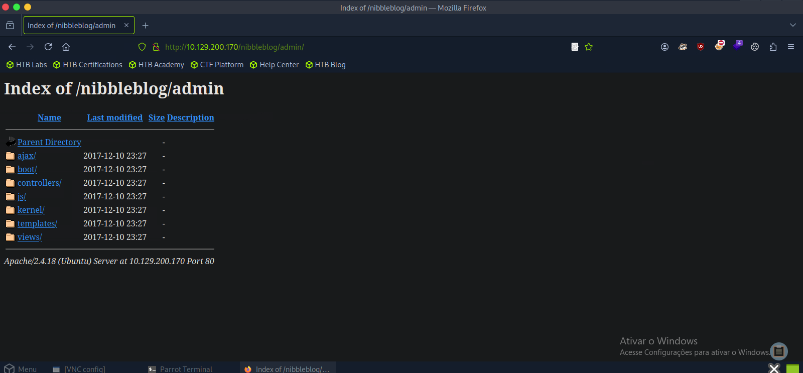
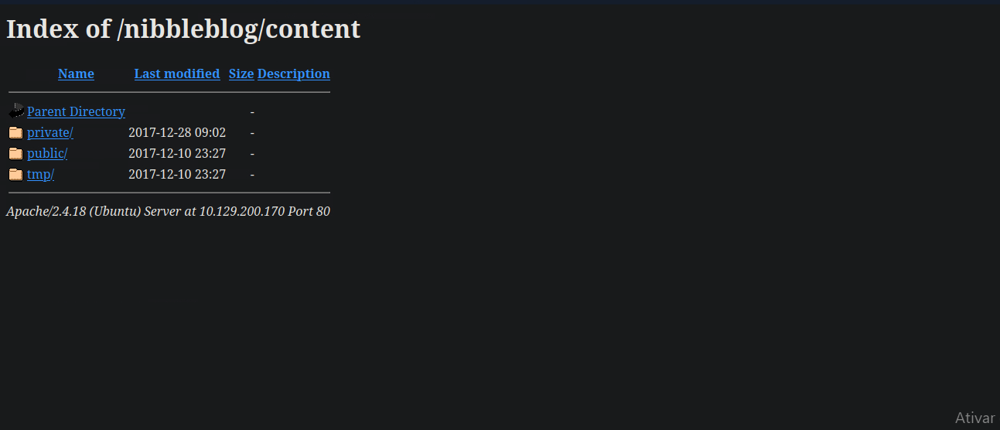
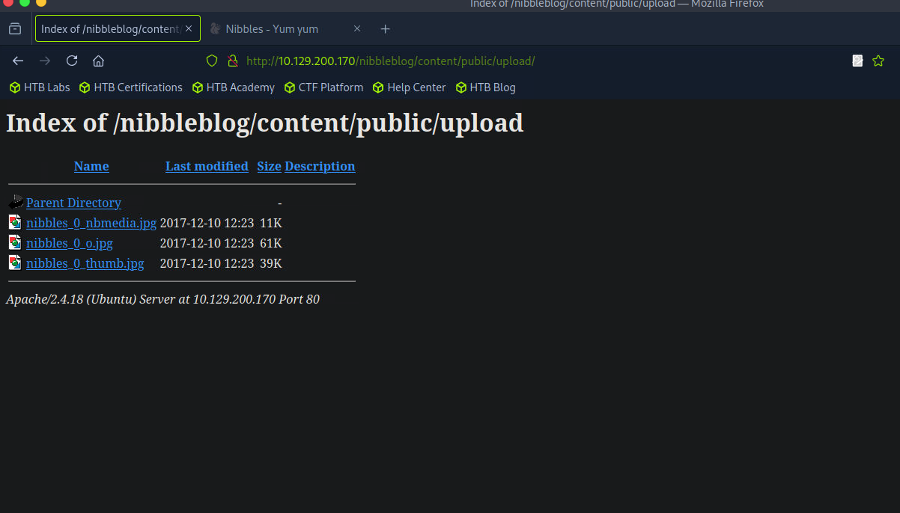
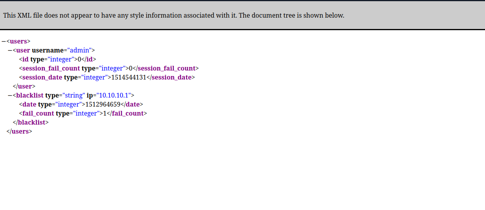
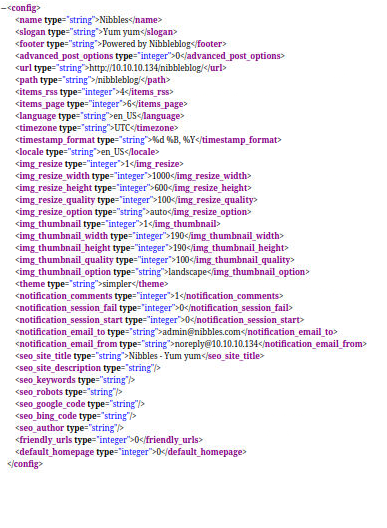
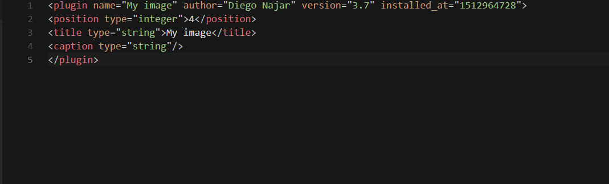

# Diretórios disponíveis

/languages            (Status: 301) [Size: 331] [--> http://10.129.200.170/nibbleblog/languages/]
/content              (Status: 301) [Size: 329] [--> http://10.129.200.170/nibbleblog/content/]
/themes               (Status: 301) [Size: 328] [--> http://10.129.200.170/nibbleblog/themes/]
/admin                (Status: 301) [Size: 327] [--> http://10.129.200.170/nibbleblog/admin/]
/plugins              (Status: 301) [Size: 329] [--> http://10.129.200.170/nibbleblog/plugins/]

Esses diretórios com status 301 são redirecionamentos e possivelmente indicam CMS (Content Management System) como Wordpress, Joomla, Drupal, etc. O diretório /admin é um forte indicativo de que o CMS é o Nibbleblog, que é um CMS de blog simples e leve.

## Diretório admin

Todos os arquivos em formato.bit ou php, nenhuma informação útil aparente.

## Diretório content

### public

A sub-pasta public contém /upload/
3 imagens presentes

O conteúdo das imagens é inútil mas o diretório pode ser usado para upload de arquivos

### private
Sub-Pasta private contém dados importantes

[users.xml](xml/users.xml)

O arquivo users.xml contém informações sobre o usuário admin

[users.xml](xml/config.xml)

Arquivo de configuração do xml contém o email do admin, o nome do email recebe o nome de usuário correspondente, então possivelmente a senha correspondente é nibbles.

Sub-pasta plugins/my_image contém um banco de dados com uma imagem 

[db.xml](xml/imageDb.xml)

